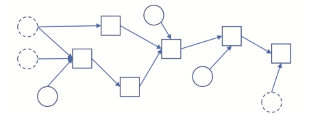
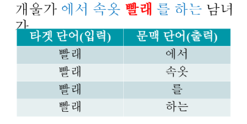
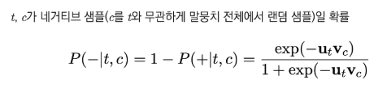

# 자연어처리 특강

Created: Nov 11, 2019 10:31 AM

# 임베딩이란

단어나 문장을 벡터로 바꾼 것 혹은 그 과정

## 임베딩으로 할 수 있는 것

관련도/유사도 계산

시각화

벡터 연산(유추평가)

전이학습

## 임베딩의 의미

일단 빈도를 센다 (문서를 쓴 이의 의도는 단어 사용 패턴에 드러난다)

단어가 어떤 순서로 나타나는지 살핀다 (시퀀스 정보에 의미가 녹아있다)

단어가 어떤 단어와 주로 같이 나타나는지 살핀다 (문맥의 의미가 녹아 있다)

요즘엔 BERT를 많이 사용

문장 수준 임베딩 : ELMo, BERT

# 단어 임베딩 구축

Deep Neural Networks

로지스틱 회귀 : x를 모델에 넣으면 0~1 사이의 확률 리턴

뉴럴넷을 Directed Acyclic Graph + Probability Model로 볼 수 있다

그런데 그 구조를 유연하고 자유롭게 설계할 수 있다

뉴럴넷 확률모델로 이해할 필요가 있다

뉴럴넷은 학습 손실로 잘하고 못하고를 확인할 수 있다

Backpropagation

학습 손실을 최소화하는 방향으로 모델을 업데이트

최소화하는 방향은 어떻게? 미분과 체인룰

# Word2Vec

## Skip-Gram Model

타겟 단어(t)로 문맥 단어(c)를 맞추는 과정에서 학습

개울가 에서 속옷 **빨래**를 하는 남녀

타겟 단어를 입력하면 |V|차원의 확률 벡터를 리턴하는 뉴럴넷

자연어처리 관련 문서

[https://wikidocs.net/22647](https://wikidocs.net/22647)

벡터

[https://datascienceschool.net/view-notebook/29502582b0ae4730bdf1a5094a290713/](https://datascienceschool.net/view-notebook/29502582b0ae4730bdf1a5094a290713/)

# Skip-Gram with Negative Sampling

타겟 단어(t)로 문맥 단어(c)를 맞추는 과정에서 학습

**문제점**

모델을 학습하려면 소프트맥스 확률을 반드시 구해야 한다

그런데 단어 수가 많아서(보통 10만개 이상) 계산량이 너무 크다!

**해결책**

소프트맥스 대신 시그모이드(sigmoid)를 써보자!

타겟 단어를 넣어서 문맥 단어를 맞춘다 mutinomial classification

타겟 단어-문맥 단어 쌍이 실제 등장하는지 여부를 맞춘다

binary classification

네거티브 쌍은 내적값 하향 > 코사인 유사도 낮아짐

positive : 우리가 맞춰놓은 셋

negative : 엉뚱한 셋

# 단어 임베딩으로 문서 분류하기

컨셉 : 문서에 속한 단어가 유사하면서 문서 의미도 비슷하다

학습데이터 댓글을 모두 문서 벡터(단어 임베딩의 합)로 변환한다