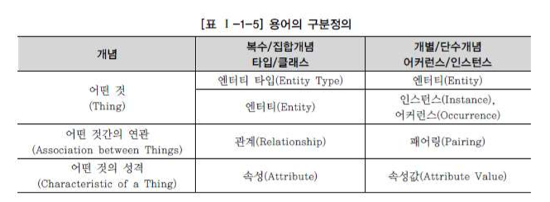

# 모델링

# 모델링의 이해

## 모델링의 정의

- webster 사전
    - 가설적 또는 일정 양식에 맞춘 표현
    - 어떤 것에 대한 예비표현으로, 그로부터 최종 대상이 구축되도록 하는 계획으로서 기여하는 것
- 복잡한 현실세계를 단순화시켜 표현하는 것
- 사물 또는 사건에 관한 양상이나 관점을 연관된 사람이나 그룹을 위하여 명확하게 하는 것이다
- 현실세계의 추상화된 반영이다.

## 모델링의 특징

추상화, 단순화, 명확화

- 추상화 : 일정한 형식에 맞추어 표현
- 단순화 : 제한된 표기법이나 언어로 표현
- 명확화 : 대상에 대한 애매모호함을제거하고 정확하게 현상을 기술

## 모델링의 세 가지 관점

- 데이터 관점 : 업무가 어떤 데이터와 관련이 있는지, 데이터간의 관계는 무엇인지
- 프로세스 관점 : 업무가 실제하고 있는 일은 무엇인지, 무엇을 해야하는지
- 데이터와 프로세스의 상관관점 : 업무가 처리하는 일의 방법에 따라 데이터는 어떨게 영향을 받고 있는지

# 데이터 모델의 기본 개념의 이해

## 모델링의 정의

- 정보시스템을 구축하기 위한 데이터 관점의 업무 분석 기법
- 현실 세계의 데이터에 대해 약속된 표기법에 의해 표현하는 과점
- 데이터베이스를 구축하기 위한 분석/설계의 과정

## 데이터 모델이 제공하는 기능

- 시스템을 현재 또는 원하는 모습으로 가시화하도록 도와준다
- 시스템의 구조와 행동을 명세화 할 수 있게 한다
- 시스템을 구축하는 구조화된 틀을 제공한다
- 시스템을 구축하는 과정에서 결정한 것을 문서화한다
- 다양한 영역에 집중하기 위해 다른 영역의 세부 사항은 숨기는 다양한 관점을 제공한다
- 특정 목표에 따라 구체화된 상세 수준의 표현방법을 제공한다

## 데이터 모델링의 중요성 및 유의점

파급효과, 복잡한 정보 요구사항의 간결한 표현, 데이터 품질

데이터 모델링을 할 떄 유의점 : 중복, 비유연성, 비일관성

# 데이터 모델링의 3단계 진행

## 개념적 데이터 모델링

추상화 수준이 높고 업무 중심적이고 포괄적인 수준의 모델링 진행.

전사적 데이터 모델링, EA수립시 많이 이용

사용자의 데이터 요구사항을 찾고 분석하는데서 시작, 어떠한 자료가 유지되어야 하는지를 결정하는 것을 포함

## 논리적 데이터 모델링

시스템으로 구축하고자 하는 업무에 대해 Key, 속성, 관계 등을 정확하게 표현, 재사용성이 높음

## 물리적 데이터 모델링

실제로 데이터베이스에 이식할 수 있도록 성능, 저장 등 물리적인 성격을 고려하여 설계

# 데이터 모델링에서 데이터 독립성의 이해

## 데이터 독립성의 필요성

- 상호간 영향에서 벗어나 개별 형식이 가지는 고유의 기능을 유지시키며 그 기능을 극대화
- 유지보수 비용 절감
- 데이터 중복성 줄임
- 데이터 복잡도 낮춤
- 요구사항 대응

# 데이터 모델링의 중요한 세 가지 개념

## 데이터 모델링의 세 가지 요소

- 업무가 관여하는 어떤 것, 어떤 것이 가지는 성격, 업무가 관여하는 어떤 것 간의 관계

엔터티 : 어떤 것에 대한 집합

# 좋은 데이터 모델의 요소

- 완전성
- 중복배제
- 업무규칙
- 데이터 재사용
- 의사소통
- 통합성