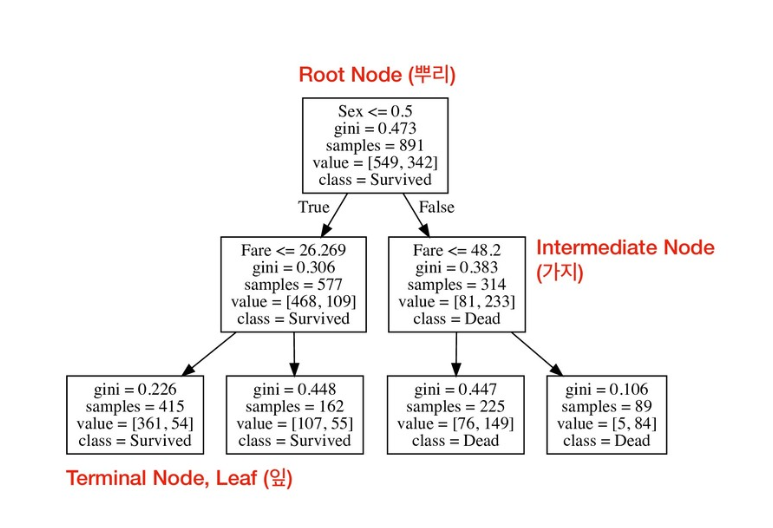
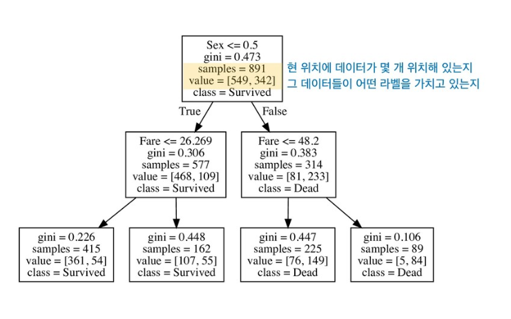
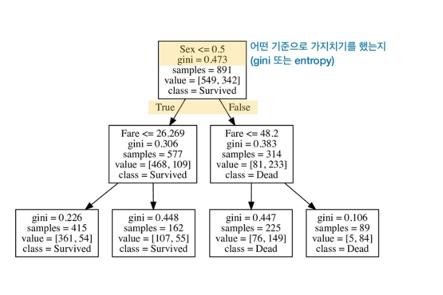
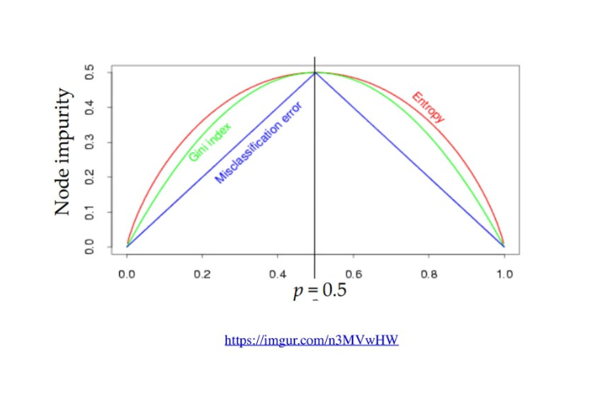
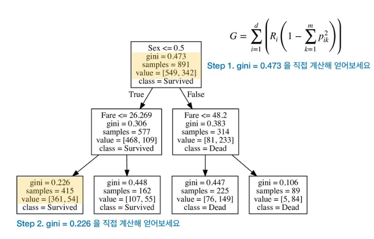
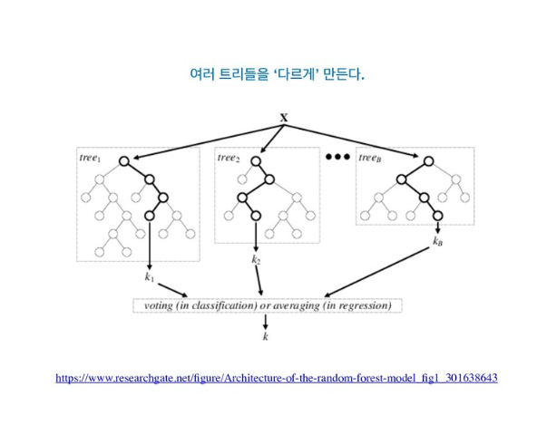
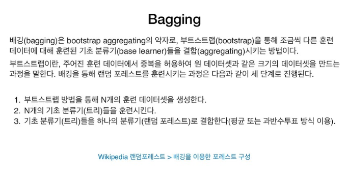

# Tree methods

Created: Nov 04, 2019 2:06 PM

수업자료 : [https://speakerdeck.com/ysunmi0427/tree-methods?slide=6](https://speakerdeck.com/ysunmi0427/tree-methods?slide=6)

머신러닝 문제에는 회기(regression), 분류(classification) 두가지 분류가 있다.

# Decision Tree

terminal node가 결과를 내는 node다

class는 sample중에 vlaue가 큰 값으로 된다.

라벨에 따라서 value를 나눈다

라벨 = 클래스, y값, 타겟벨류, dependent variable, 종속변수

sex가 1이면 여자, true로 빠짐

gini : 불순도

gini가 낮아지는 방향으로 가지를 친다→ 순도가 올라간다는 뜻

순도가 올라간다는 것은 박스에 들어있는 vlaue가 한 쪽으로 치우친다는 뜻, 특정라벨의 값을 가지는 것끼리 몰리도록

아래로 내려갈 수록 순도가 높아진다

terminal node

순도가 증가하는 것을 두고 information gain이라고 한다

코드

- 하이퍼파라미터(max_depth, max_leaf_nodes) : 머신러닝 모델이 스스로 찾지 못하고 인간이 설정해줘야 하는 feature
- fitting은 train data로, 예측은 test로 한다

p=0.5라는 것은

데이터가 반반씩 박스에 나뉘어져 있다는 뜻, 라벨이 고르가 분포해 있을 때

p 는 확률을 말한다. 박스에서 value의 값

불순도의 최대치는 확률이 50, 50일 때 0.5로 가장 높다

step1.

1-((549/891)**2 + (342/892)**2) = 0.47334311328

step2.

1-((361/415)**2 + (54/415)**2) = 0.22637828422

# Random Forest

tree를 여러개 다르게 만드는 것

bootstraping으로 

bagging : bootstrap aggregating의 약자

트리를 배깅 방식으로 한 것, 랜덤 포레스트

tree 하나로만 하는 것보다 더 나을거라는 가정하에 사용

over fitting의 문제를 줄일 수 있다

앙상블 : 여러 모델을 돌려서 그 결과를 합치는 방식으로 예측할 수 있다

배깅 방법으로 앙상블을 할 수 있다